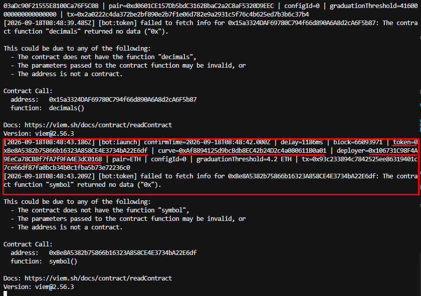

# Robinhood Pons Sniping Bot

Detect new **Pons V2** token launches on Robinhood Chain (chain id `4663`), fetch token metadata, and buy on the bonding curve with snipe-tax protection, slippage limits, and priority gas.

## Features

- Live `TokenLaunched` WebSocket subscription
- Detection delay logging (`confirmTime` vs detect time)
- Token metadata with retry (`name`, `symbol`, `getTokenInfo()`)
- Pause detection while waiting / buying (one launch at a time)
- Snipe tax guard via `currentSnipeTaxBps()`
- Slippage-protected buys (`minTokensOut` from simulation)
- EIP-1559 priority gas for faster confirmation

## Quick start

```bash
npm install
cp .env.example .env
npm start
```

## Environment

| Variable | Required | Description |
|---|---|---|
| `ROBINHOOD_WSS_URL` | yes | WebSocket RPC URL |
| `ROBINHOOD_RPC_URL` | no | HTTP RPC for reads/txs (defaults to WSS → `https://`) |
| `BACKFILL_BLOCKS` | no | Historical backfill on startup (`0` = live only) |
| `BUY_ENABLED` | no | Enable auto-buy (default `true`) |
| `PRIVATE_KEY` | if buy enabled | Wallet private key |
| `BUY_AMOUNT_ETH` | no | ETH per buy (default `0.01`) |
| `BUY_DELAY_MS` | no | Min wait after confirm (default `2000`) |
| `MAX_SNIPE_TAX_BPS` | no | Max snipe tax in bps (default `100`) |
| `SNIPE_TAX_POLL_MS` | no | Snipe tax poll interval (default `200`) |
| `SNIPE_TAX_MAX_WAIT_MS` | no | Max extra wait for tax drop (default `8000`) |
| `SLIPPAGE_BPS` | no | Slippage tolerance (default `300` = 3%) |
| `PRIORITY_FEE_GWEI` | no | Priority fee (default `2`) |
| `MAX_FEE_GWEI` | no | Max fee cap (default `50`) |
| `BUY_RESUME_ON_FAILURE` | no | Resume after failed buy (default `false`) |

## Example output



## Project structure

```
src/
├── index.ts
├── bot/sniping-bot.ts       # Orchestrator
├── detector/                # Launch detection
├── buy/                     # Buy, snipe tax, tx quote/gas
├── token/                   # Metadata fetch + format
├── contracts/pons.ts        # ABIs + addresses
├── rpc/clients.ts           # WS, HTTP, wallet clients
├── config/
├── chain/
└── lib/                     # logger, sleep, helpers
```

## Scripts

```bash
npm start
npm run typecheck
```
